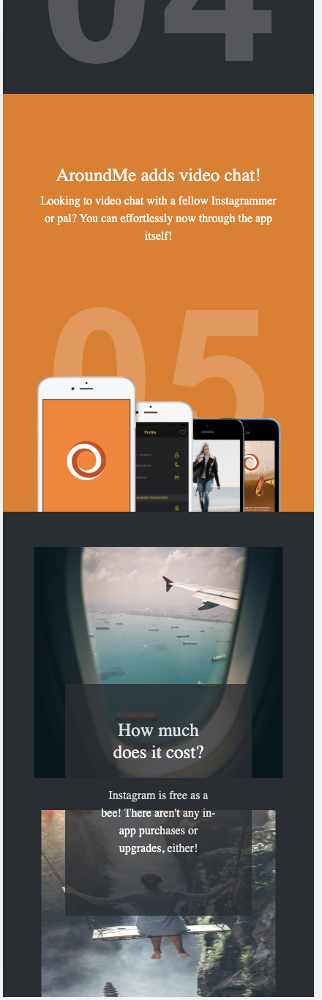
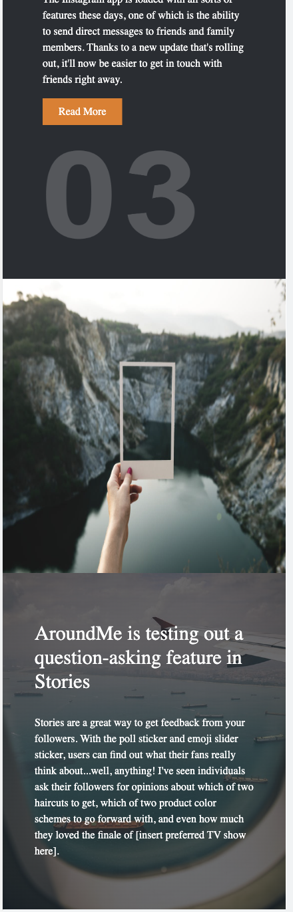

# Projet "Landing Page" - ACS 2022 - Online Formapro - FR version

Dans ce projet individuel, nous devons expérimenter plusieurs phases de la réalisation d'un projet web. Intégration d'une maquette et son passage en production. 
Une version responsive sur mobile, tablette et desktop est requise. Le code source devant être poussé sur Github et le site hébergé sur notre serveur public. 

## Étapes principales demandés

1 Créer la base du projet et le pousser sur **Github**.
2 Création de trois branches distinctes afin d'organiser le code pour chaque élement de la page.
3 Prise en compte du **framework Bootstrap** et intégration dans le HTML.
4 Télechargement des images du site [Nice Page](https://nicepage.com/landing-page/preview/everything-is-technology-19816)
5 Initiation et utilisation de la fonction "project" sur Github afin d'organiser les tâches. 
6 Récupération du code des trois branches crées (git merge).
7 Mise en ligne via le logiciel **Cyberduck**.
8 Test du responsive pour les trois formats demandés.
9 Test de la page via **GTMetrix** afin d'obetenir un score de 100%

## Score GT Metrix

- 92%

## 📸 Screenshots

## Liens vers le projet

- [GitHub]()
- [Serveur Public](https://priscad.promo-171.codeur.online/landing-page0/)

## Contact

- Priska Derville 👩🏾‍💻 [GitHub](https://github.com/PriskaSama)

## Ressources

- [Bootstrap](https://getbootstrap.com/)
- [Tailwind CSS](https://tailwindcss.com/)
- [NicePage](https://nicepage.com/landing-page/preview/everything-is-technology-19816?device=desktop)
- [Markdown Guide](https://www.markdownguide.org/)
- [Stackoverflow](https://stackoverflow.com/)
- [W3C](https://www.w3.org/)
- [W3Schools](https://www.w3schools.com/)
- [Deveolper Mozilla](https://developer.mozilla.org/fr/)
- [Readme.so](https://readme.so/fr)
- [GT Metrix](https://gtmetrix.com/)

--------- --------- -------- ------- -------- --------- ------- ---------- ----------

# "Landing Page" Project - ACS 2022 - Online Formapro - EN version

In this individual project, we have to experiment several phases of the realization of a web project. Integration of a model and its passage in production. 
A responsive version on mobile, tablet and desktop is required. The source code must be pushed on Github and the site hosted on our public server. 

## Main steps to do

1 Create the project base and push it to **Github**.
2 Creating three separate branches to organize the code for each element of the page.
3 Taking into account the **Bootstrap Framework** and integration in the HTML.
4 Downloading of the images of the site [Nice Page](https://nicepage.com/landing-page/preview/everything-is-technology-19816)
5 Initiation and use of the "project" function on Github to organize the tasks. 
6 Recovery of the code of the three created branches (git merge).
7 Putting online via the **Cyberduck** software.
8 Test of the responsive for the three requested formats.
9 Test of the page via **GTMetrix** to obtain a score of 100%.

## GT Metrix score

- 92%

## 📸 Screenshots

## Project's links

- [GitHub]()
- [Serveur Public](https://priscad.promo-171.codeur.online/landing-page0/)

## Contact

- Priska Derville 👩🏾‍💻 [GitHub](https://github.com/PriskaSama)

## Appendix

- [Bootstrap](https://getbootstrap.com/)
- [Tailwind CSS](https://tailwindcss.com/)
- [NicePage](https://nicepage.com/landing-page/preview/everything-is-technology-19816?device=desktop)
- [Markdown Guide](https://www.markdownguide.org/)
- [Stackoverflow](https://stackoverflow.com/)
- [W3C](https://www.w3.org/)
- [W3Schools](https://www.w3schools.com/)
- [Deveolper Mozilla](https://developer.mozilla.org/fr/)
- [Readme.so](https://readme.so/fr)
- [GT Metrix](https://gtmetrix.com/)
